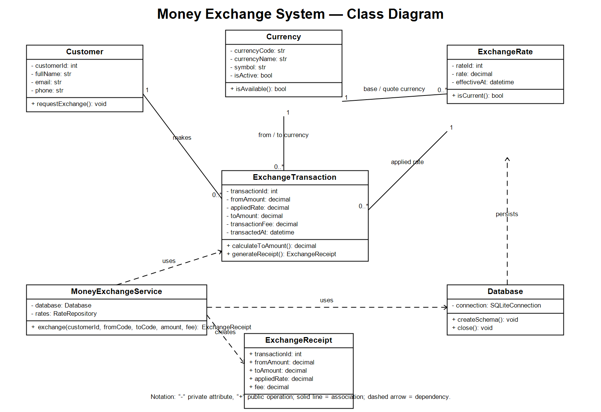

# Week 4 — Class Diagram: Money Exchange System

## Number of class diagrams: 1

I created **one class diagram**. The defined project scope is a single Money Exchange System, and one diagram is sufficient to show its complete domain model, service layer, persistence boundary, and their relationships without splitting closely related functionality across multiple diagrams.

## Purpose

The diagram describes the object-oriented structure required to manage customers, currencies, exchange rates, and completed exchange transactions. It also shows the service that coordinates the exchange workflow and the database component that stores the information.

## Main classes and functionality

| Class | Purpose and main functionality |
|---|---|
| `Customer` | Stores a customer's identity and contact details. A customer can request exchanges. |
| `Currency` | Represents a supported currency, including its code, name, symbol, and active status. |
| `ExchangeRate` | Stores a directed base/quote currency rate and the time it becomes effective. |
| `ExchangeTransaction` | Records an exchange with amounts, applied rate, fee, and timestamp; can calculate the destination amount and generate a receipt. |
| `MoneyExchangeService` | Coordinates exchange business rules: validates input, finds the current rate, calculates output, and records the transaction. |
| `Database` | Owns the SQLite connection and creates/closes the database schema. |
| `ExchangeReceipt` | A value object returned after a successful exchange; contains the final transaction details for the customer. |

## Relationships

- One `Customer` makes zero or many `ExchangeTransaction` records; each transaction belongs to exactly one customer.
- One `Currency` can be used by many transactions as the source or destination currency, and by many exchange rates as the base or quote currency.
- One `ExchangeRate` can be applied to many transactions; each transaction keeps the specific rate used for audit accuracy.
- `MoneyExchangeService` depends on the domain classes, creates an `ExchangeReceipt`, and uses `Database` to store and retrieve information.
- `Database` persists the domain data represented by the classes.

## Alignment with Week 3 implementation

The diagram corresponds to the Week 3 tables (`customers`, `currencies`, `exchange_rates`, and `exchange_transactions`) and the OOP components already used in the Python implementation (`Database`, repositories, `MoneyExchangeService`, and `ExchangeReceipt`).
